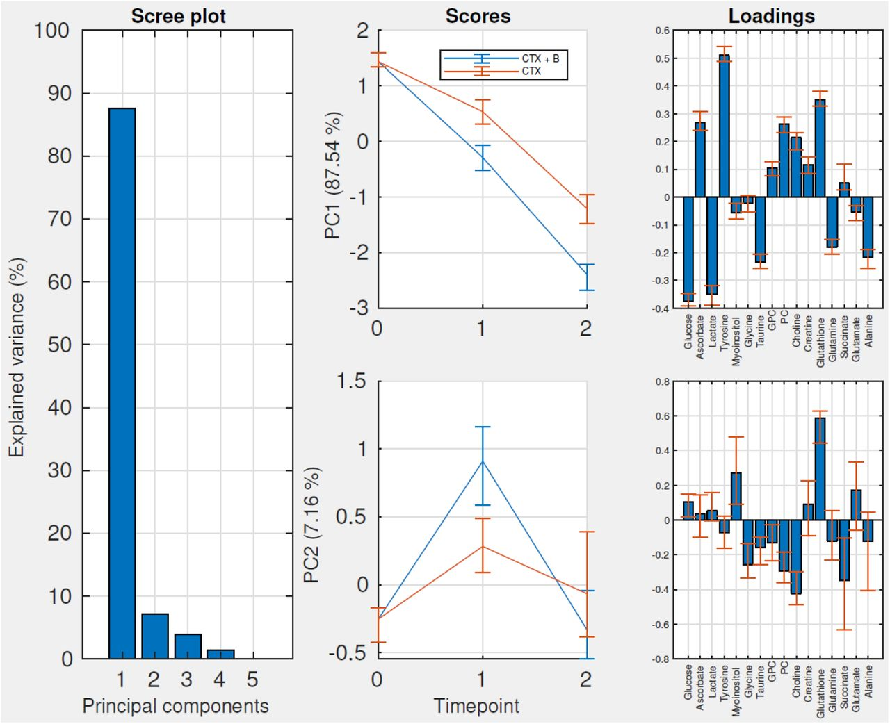

  
```{r, include = FALSE}
knitr::opts_chunk$set(
  collapse = TRUE,
  comment = "#>",
  out.width = "100%", 
  fig.asp = 0.7,
  fig.width = 12,
  fig.align = "center",
  cache = FALSE,
  external = FALSE
)
df <- read.csv(file = "metabolics.csv", header = TRUE, sep = ";")
df$ID <- df$ï..ID
#df <- subset(df, df$ID %in% unique(df$ID)[Reduce(cbind,lapply(unique(df$ID), function(x) sum(df$ID == x) == 3))])
df$ï..ID <- NULL
df <- reshape2::melt(df, id.vars = c("ID", "time", "group", "response"))
df$time <- factor(df$time)
df$group <- factor(df$group)
df <- subset(df, !is.na(df$ID))
```

# Metabolomics

```{r setup}
library(RMASCA)
```

This time we will look at a small metabolomics dataset by @eucedaEvaluationMetabolomicChanges2017 and replicate the findings of @madssenRepeatedMeasuresASCA2020a. Let us start by having a quick look at it:

```{r}
do.call(
  ggpubr::ggarrange,
  c(plotParts(df, participantColumn = "ID", valueColumn = "value", addSmooth = NA), 
                      common.legend = TRUE, legend = "bottom")
  )
```

So there is three time points, two groups and 16 variables. ??? state that <blockquote>All metabolite responses were log-transformed before analysis, and the effect matrix was mean-centered before PCA.</blockquote> But our data is already log-transformed, and centering is handled by RMASCA(). But we need to scale each metabolite with the standard deviation at baseline, as instructed by the authors. So let us set the desired reference groups and normalize:

```{r}
df$group <- relevel(df$group, ref = "Chemotherapy only")
df$time <- relevel(df$time, ref = "TP1")

for(i in unique(df$variable)){
  df$value[df$variable == i] <- df$value[df$variable == i]/sd(df$value[df$variable == i & df$time == "TP1"])
}
```

Without any fuss, let us see what RMASCA makes out of it using the same model as @madssenRepeatedMeasuresASCA2020a. Note that we have to `forceEqualBaseline` to remove the interaction term for TP1 * treatment.

```{r}
form <- value ~ time + time:group + (1|ID)
mod <- RMASCA(df, form, separateTimeAndGroup = FALSE, forceEqualBaseline = TRUE, scale = FALSE)
```

Let us check that our model is as expected:

```{r}
summary(mod$lmer.models[[1]])
```


And now, let us plot it:

```{r}
screeplot(mod)
```

And compare to the original plot:



```{r}
plot(flipIt(mod))
```

Note that we used the flipIt() function to flip the loadings and scores to produce similar plots as in the original article.

```{r}
plot(mod, component = "PC2")
```

As we can see, it looks indeed as a very good match with the original findings.

Let us validate our model (outside knitr, it uses about 2 seconds per run),

```{r, message=FALSE}
mod.val <- validate(mod, participantColumn = "ID")
```

The result **Her blir det feil av en eller annen grunn...**:

```{r}
plot(mod.val)
plot(mod.val, component = "PC2")
```

## References